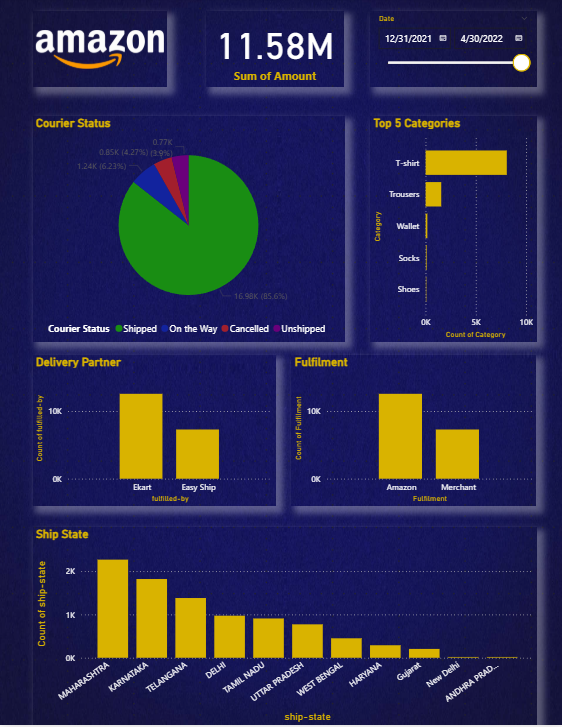

# 📊 Amazon Sales Dashboard — Power BI Project

## 📝 Project Overview
This project showcases a **Sales Performance Dashboard** built using **Power BI**. The dashboard provides insights into Amazon sales data across categories, courier statuses, fulfillment partners, and regional shipping trends. It is designed to help stakeholders quickly understand key metrics like top-selling products, order fulfillment efficiency, and regional performance.

---

## 🖼️ Dashboard Preview

---

## 📈 Key Insights
- **Total Sales Amount:** ₹11.58 Million (Dec 2021 to April 2022)
- **Top 5 Product Categories:** T-shirts, Trousers, Wallets, Socks, Shoes.
- **Courier Status Breakdown:** 
  - Shipped: 85.6%
  - On the Way: 6.23%
  - Cancelled/Unshipped: ~8%
- **Fulfillment Partners:**
  - Ekart and Amazon Merchant are the top fulfillment providers.
- **Top Shipping States:** Maharashtra, Karnataka, Telangana, Delhi, Tamil Nadu.

---

## 📂 Project Files
| File Name                        | Description                              |
|-----------------------------------|------------------------------------------|
| Amazon Sales Dashboard PDF.pdf    | PDF version of the Power BI Dashboard    |
| Dashboard-Screenshot.png          | Dashboard preview image                  |
| README.md                         | Project documentation (this file)        |

---

## 🛠️ Tools & Technologies
- Power BI Desktop
- DAX (for custom measures)
- Power Query (data cleaning)

---

## 🔗 How to View the Dashboard
1. Open **Amazon Sales Dashboard PDF.pdf** to explore the complete dashboard.
2. Refer to **Dashboard-Screenshot.png** for a quick visual preview.

---

## ⭐ If you found this project interesting, please give it a Star!

